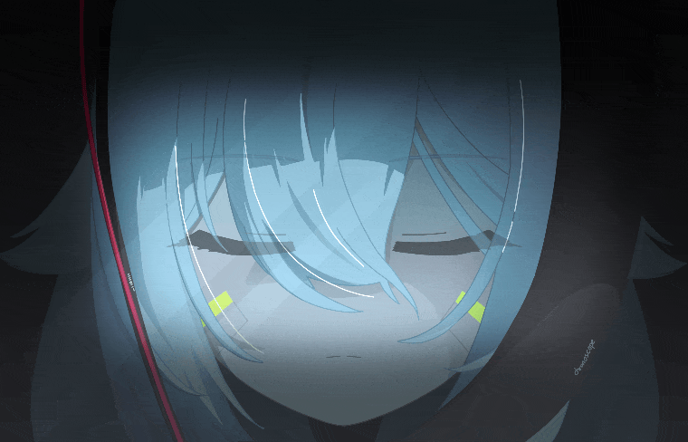
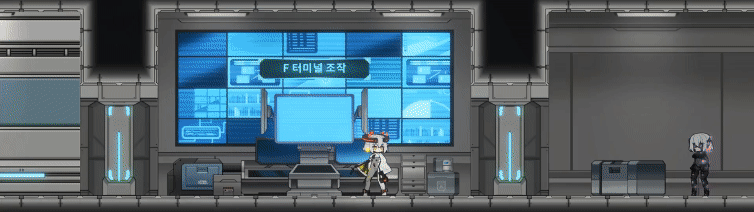
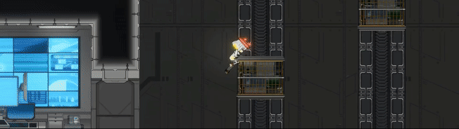
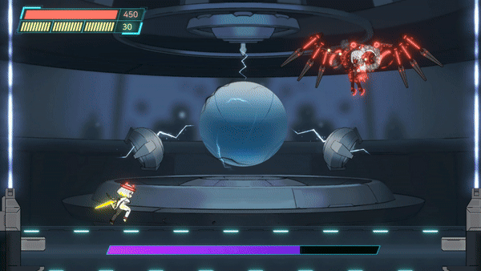

※ 에셋 저작권 문제로 인해, 기존 저장소를 정리하고 새로 생성한 리포지토리입니다.

  

## 개요
<table>
  <tr><td>기간</td><td>2024.01 ~ 2024.06</td></tr>
  <tr><td>인원</td><td>6명(클라이언트 1, 기획 1, 아트 2, 사운드 1, UI 1)</td></tr>
  <tr><td>역할</td><td>팀장, 클라이언트</td></tr>
  <tr><td>도구</td><td>UNITY, C#, SPINE</td></tr>
  <tr><td>타겟 기기</td><td>PC</td></tr>
  <tr><td>참여 활동</td><td>슬기로운 데모생활, GIGDC</td></tr>
</table>

이 프로젝트는 데모 게임 출시와 대회 참여를 목적으로 진행되었습니다.

ZETA는 사이버펑크와 SF 세계관을 배경으로 한 2D 액션 플랫폼 게임입니다.

플레이어는 속도를 늦춰 적의 공격을 회피하고, 해킹을 통해 적을 무력화시키거나 적의 공격을 역이용해 반격하는 전투를 펼칠 수 있습니다.

연구소에서 실험을 위해 만들어진 안드로이드 주인공은 혼란을 틈타 탈출하면서, 자신의 이야기를 시작하게 됩니다.

## 인게임 사진

  

가로막는 안드로이드 적들을 모두 처치하세요!

  

가속을 활용하여, 장애물들을 뚫고 나가세요!

  

적의 공격을 전투 해킹을 이용하여, 역으로 이용하세요!

## 관련 링크
<table>
  <tr><td>시연 영상</td><td><a href="https://www.youtube.com/watch?v=WFMWcFAJMYU&ab_channel=%ED%94%8C%EB%A0%88%EC%9D%B4%EC%98%81%EC%83%81">바로가기</a></td></tr>
  <tr><td>편집 영상</td><td><a href="https://www.youtube.com/watch?v=KSnyiX2CyX4&feature=youtu.be">바로가기</a></td></tr>
  <tr><td>게임 상점</td><td><a href="https://store.onstove.com/ko/games/3838">바로가기</a></td></tr>
</table>
